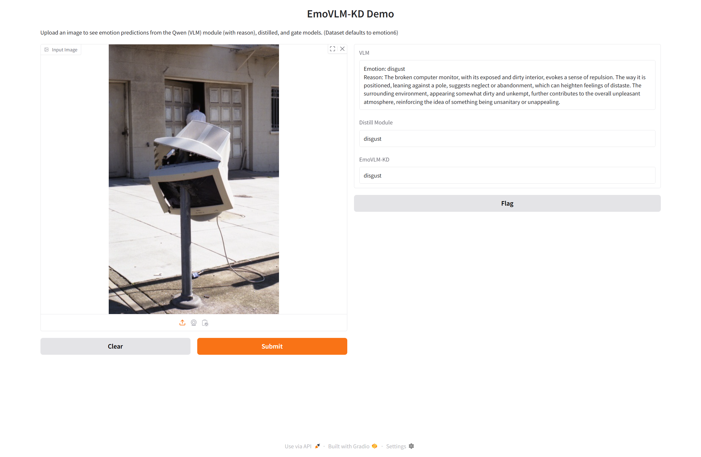

# EmoVLM-KD
Official code for the paper "EmoVLM-KD: Fusing Distilled Expertise with Vision-Language Models for Visual Emotion Analysis"


## Abstract
Visual emotion analysis, which has gained considerable attention in the field of affective computing, aims to predict the dominant emotions conveyed by an image. Despite advancements in visual emotion analysis with the emergence of vision-language models, we observed that instruction-tuned vision-language models and conventional vision models exhibit complementary strengths in visual emotion analysis, as vision-language models excel in certain cases, whereas vision models perform better in others. This finding highlights the need to integrate these capabilities to enhance the performance of visual emotion analysis. To bridge this gap, we propose EmoVLM-KD, an instruction-tuned vision-language model augmented with a lightweight module distilled from conventional vision models. Instead of deploying both models simultaneously, which incurs high computational costs, we transfer the predictive patterns of a conventional vision model into the vision-language model using a knowledge distillation framework. Our approach first fine-tunes a vision-language model on emotion-specific instruction data and then attaches a distilled module to its visual encoder while keeping the vision-language model frozen. Predictions from the vision language model and distilled modules are effectively balanced by the gate module, which subsequently generate the final outcome. 

<div align="center">
  
</div>


## Setup 
**Environmental setup**
```
# Clone the repository
git clone 

# Install dependencies
pip install -r requirements.txt
```

**Dataset**

We assume that the image emotion dataset is located as follows. For some datasets, if a validation dataset is not available, they may consist of only train and test sets.
- images  
  - FI  
    - train  
      - amusement  
      - anger  
      - sadness  
      - fear
      - ...
    - val  
    - test
  - ...

## Emotion Instruction Data Generation 
```
python generate_instructions.py --dataname emoset --api_key <api_key>
```
Or you can use the instructions we created.
- abstract: 
- artphoto: 


## Vision-language model training
```
python train_vlm.py --dataname emoset --gpu 1
```
Arguments are as follows.
- dataname
- gpu


## Knowledge distillation

```
python train_distillation.py --dataname emoset --gpu 1
```

## Training a gate module

```
python train_gate.py --dataname emoset --gpu 1
```

## Simple demo


```
python demo.py
```


<div align="center">
  
</div>

